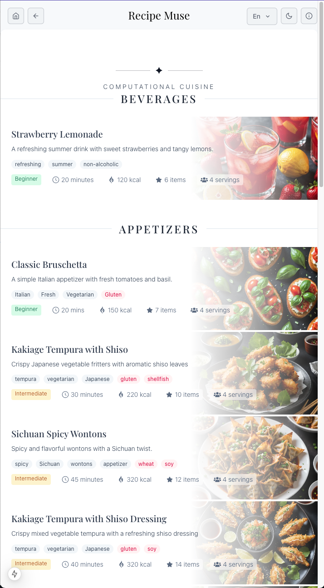
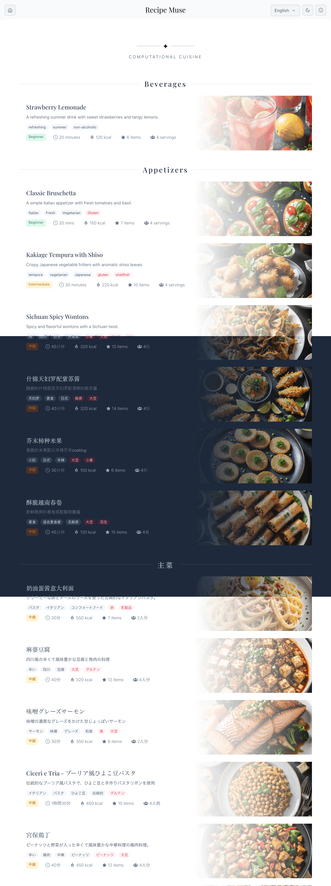
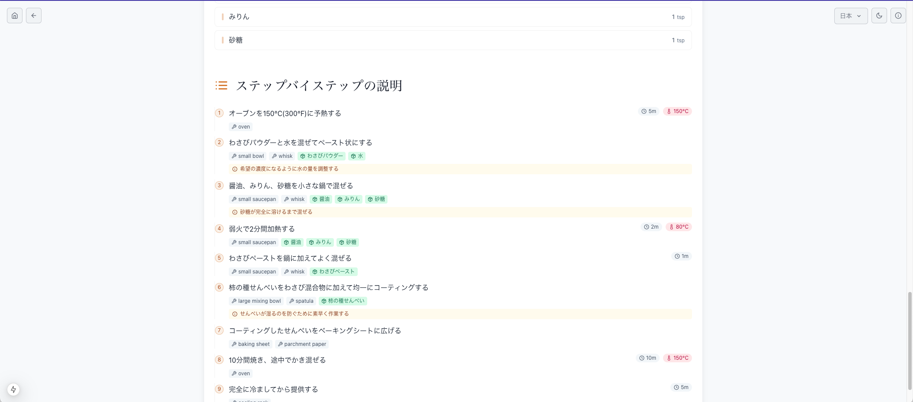

# Recipe Muse - Computational Cuisine Platform

[Recipe Muse](https://meal-muse.vercel.app/) is a fully automated Next.js platform that combines culinary arts with LLM, generating complete recipes including recipe names, detailed instructions, and generative images for each dish.

## Features

- 🍽️ Multi-language support (English, Chinese, Japanese, and more)
- 🧑‍🍳 Algorithmically-generated recipes
- 📱 Responsive design with optimized performance
- 🎨 Modern UI with interactive components
- 🔄 Real-time recipe updates and caching

## Screenshots

## TODO

[x] Recipe name and detail generate
[x] Image generate
[x] Multi-language support
[] User ingredients, cuisine custom submission
[] User signup/login, previous recipe history
[] Schedule generation
[] Backfill translator support
[] Recipe web tooling (timer, comments)
[] Payment plan

## Tech Stack

- **Framework**: [Next.js](https://nextjs.org)
- **Integrated LLM**. [Deepseek](https://platform.deepseek.com/) (chat, reasoner), [Anthropic](https://www.anthropic.com/api) (opus, sonnet 3.5), [Stability.ai](https://platform.stability.ai/) (Stable Image Core), [Open router](https://openrouter.ai/)
- **Styling**: TailwindCSS with Mantine components
- **API**: RESTful endpoints with caching
- **Database**: Firebase, Supabase
- **Internationalization**: Custom i18n implementation

## Getting Started

1. Clone the repository
2. Install dependencies:

## License

MIT License
