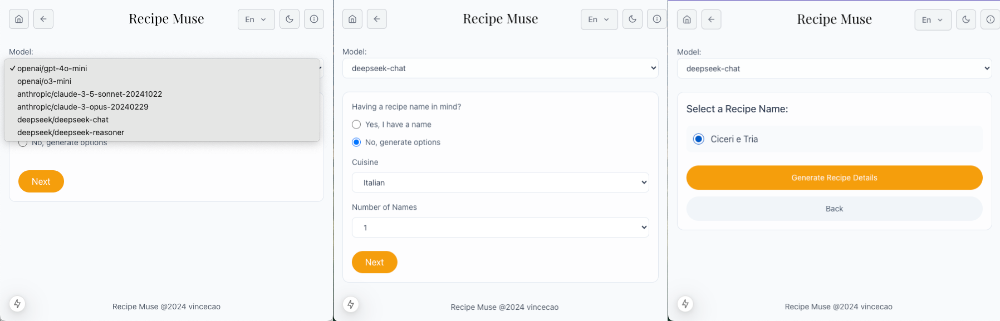

# Recipe Muse - Computational Cuisine Platform

[Recipe Muse](https://meal-muse.vercel.app/) is a fully automated Next.js platform that combines culinary arts with LLM, generating complete recipes including recipe names, detailed instructions, and generative images for each dish.

## Features

- 🍽️ Multi-language support (English, Chinese, Japanese, and more)
- 🧑‍🍳 Algorithmically-generated recipes
- 📱 Responsive design with optimized performance
- 🎨 Modern UI with interactive components
- 🔄 Real-time recipe updates and caching
- 💬 AI-powered chat assistant for existing recipe lookup and cooking suggestions

## Demonstration
Ask Muse for recipe ideas as well as existing recipe references

https://github.com/user-attachments/assets/971e06ec-fe5f-4c95-ba69-ac14a7767e11

Generating recipe

https://github.com/user-attachments/assets/fe4e4173-939e-4cd5-b7ed-2c76ccee7d18

Home Menu


Interactive chat with Muse AI assistant


Generate recipe names from input



Generated multi-language recipe detail and instructions


## TODO

- [x] Recipe name and detail generate
- [x] Image generate
- [x] Multi-language support
- [x] AI chat assistant
- [ ] User ingredients, cuisine custom submission
- [ ] User signup/login, previous recipe history
- [ ] Schedule generation
- [ ] Backfill translator support
- [ ] Recipe web tooling (timer, comments)
- [ ] Payment plan

## Tech Stack

- **Framework**: [Next.js](https://nextjs.org) with Server-Sent Events (SSE) + [Redis cache](https://redis.io/)
- **Integrated LLM**: [Openai](https://openai.com/api/) (gpt-4o-mini, o3-mini), [Anthropic](https://www.anthropic.com/api) (opus, sonnet 3.5), [Deepseek](https://platform.deepseek.com/) (chat, reasoner), [Stability.ai](https://platform.stability.ai/) (Stable Image Core), [Open router](https://openrouter.ai/)
- **Styling**: [TailwindCSS](https://tailwindcss.com/) with [Mantine](https://ui.mantine.dev/) components
- **API**: RESTful endpoints with caching
- **Database**: [Firebase](https://firebase.google.com/), [Supabase](https://supabase.com/)
- **Internationalization**: Custom i18n implementation

## Getting Started

1. Clone the repository
2. Install dependencies

``` bash
pnpm i

# finish env file based on sample

pnpm run dev
```

## License

MIT License
